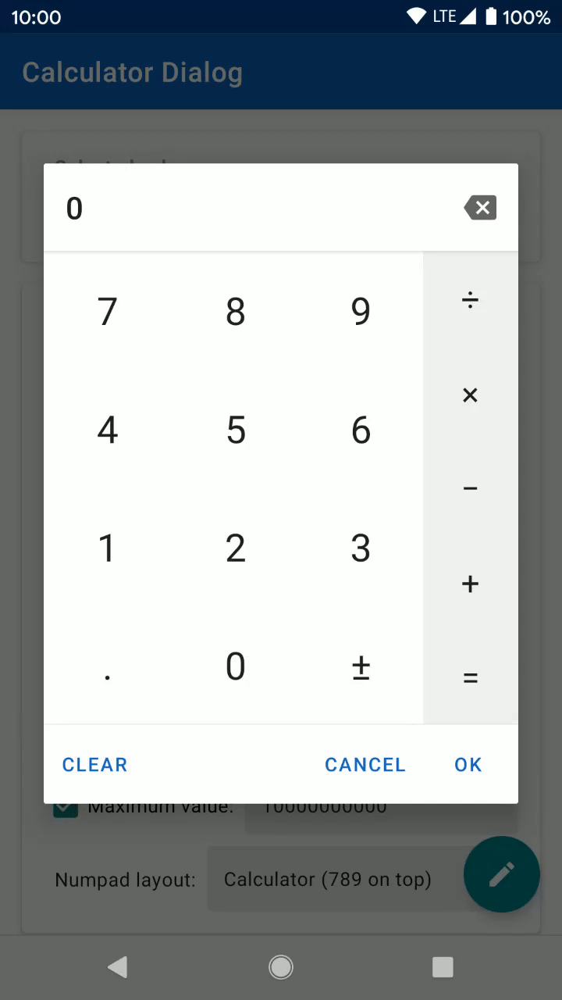
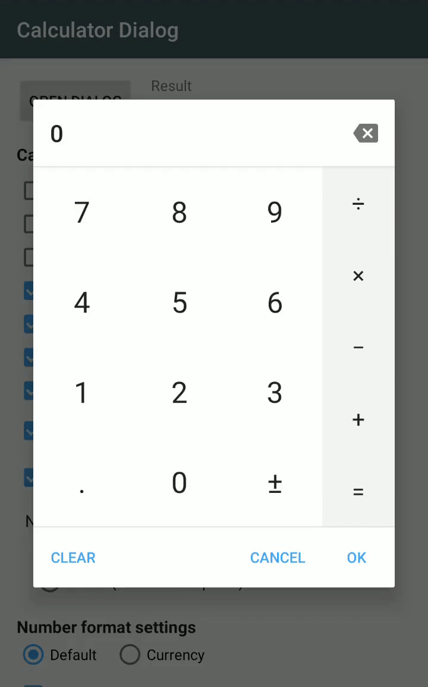

# Calculator dialog

A fully customizable calculator dialog for Android compatible with API 14.
*Note: backwards compatibility may be broken for more recent versions for API <21, to be confirmed.*
Can be used to replace the numeric keyboard and useful to enter monetary amounts for example.

 

#### Features
- Material design with Google Material Components.
- Built-in light and dark theme support.
- Customizable number format.
- Calculator or phone numpad layout styles.
- Optional min and max values showing out of bounds messages.
- Entered expression can be shown and edited.
- Optional answer button to reuse previous result.
- Order of operations can be applied or not.
- Expression can be evaluated on new operator or not.
- Optional clear button.
- Entirely customizable using custom attributes.

### Gradle dependency
```text
implementation "com.maltaisn:calcdialog:X.Y.Z"
```

Replace `X.Y.Z` with lastest version number: [![Download][download-badge]][download-link]

The `mavenCentral()` repository is required.

- Google Material Components are used since version 2.2.0
- Version 2.0.0 introduces many breaking changes, like the changed package name.
    See the [changelog](/CHANGELOG.md) for the complete list of changes.
- If you haven't migrated to AndroidX, use version 1.3.2. Versions 1.4.0 and up use AndroidX.

## Tutorial
- **Get started on the wiki page [Using the dialog][wiki-start].**
- Customize the dialog's behavior by [changing its settings][wiki-settings].
- Learn how to [style the dialog][wiki-styling] with the attributes

### Changelog
View [changelog here][changelog] for release notes.

### License
The library is licensed under Apache 2.0.

### Translation
The library is available in 16 languages. If you make a translation please make a pull request.
Strings to translate are in `strings.xml`, do not translate those in `donottranslate.xml` and
do not translate the demo app.


[download-badge]: https://img.shields.io/maven-central/v/com.maltaisn/calcdialog
[download-link]: https://search.maven.org/artifact/com.maltaisn/calcdialog

[wiki-start]: https://github.com/maltaisn/calcdialoglib/wiki/Using-the-dialog
[wiki-settings]: https://github.com/maltaisn/calcdialoglib/wiki/Calculator-settings
[wiki-styling]: https://github.com/maltaisn/calcdialoglib/wiki/Styling-the-calculator

[changelog]: CHANGELOG.md
