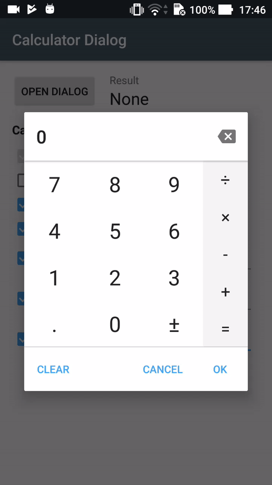

# Calculator dialog
A fully customizable calculator dialog for Android compatible with API 16. Can be used to replace the numeric keyboard and useful to enter monetary amounts.

### Gradle dependency
`compile 'com.maltaisn:calcdialog:X.Y.Z'`

Replace `X.Y.Z` with lastest version number: 

**WARNING:** version 2.0.0 introduces many breaking changes, like the changed package name. See the [changelog](/CHANGELOG.md) for the complete list of changes.

If you haven't migrated to AndroidX, use version 1.3.2. Versions 1.4.0 and up use AndroidX.

## Tutorial
- **Get started on the wiki page [Using the dialog](https://github.com/maltaisn/calcdialoglib/wiki/Using-the-dialog).**
- Customize the dialog's behavior by [changing its settings](https://github.com/maltaisn/calcdialoglib/wiki/Calculator-settings).
- Learn how to [style the dialog](https://github.com/maltaisn/calcdialoglib/wiki/Styling-the-calculator) with the attributes

## Screenshots
 
(Screenshots date back to version 1.0.0)

## Changelog
View [changelog](/CHANGELOG.md)

## Translation
The library is available in 16 languages. If you make a translation please make a pull request. Strings to translate are in `strings.xml`, do not translate those in `donottranslate.xml` and do not translate the demo app.
