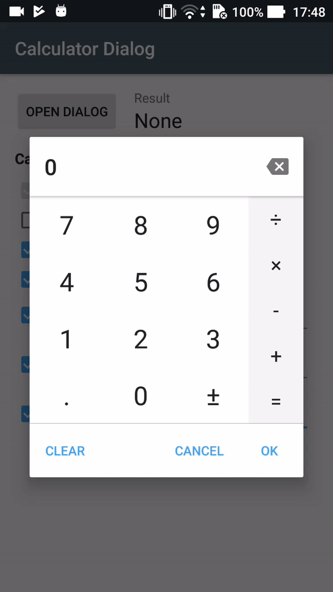

# Calculator dialog
A fully customizable calculator dialog for Android. Can be used to replace the numeric keyboard and useful to enter monetary amounts.

### Gradle dependency
`compile 'com.maltaisn:calcdialog:X.Y.Z'`

Replace `X.Y.Z` with lastest version number: 

Minimum API is [21](https://twitter.com/minSdkVersion/status/988538738639765505), and older APIs will never be supported.

## Tutorial
- **Get started on the wiki page [Using the dialog](https://github.com/maltaisn/calcdialoglib/wiki/Using-the-dialog).**
- Customize the dialog's behavior by [changing its settings](https://github.com/maltaisn/calcdialoglib/wiki/Calculator-settings).
- Learn how to [style the dialog](https://github.com/maltaisn/calcdialoglib/wiki/Styling-the-calculator) with the attributes

## Screenshots
 
(Screenshots date back to version 1.0)

## Changelog
View [changelog](https://github.com/maltaisn/calcdialoglib/blob/master/CHANGELOG.md)

## Translations
This library is only available in English and in French for now. If you make a translation please send a pull request. There are less than 10 strings to translate, it's an easy job! Strings to translate are in `strings.xml`, do not translate those in `donottranslate.xml`. And don't waste your time translating the demo app.
